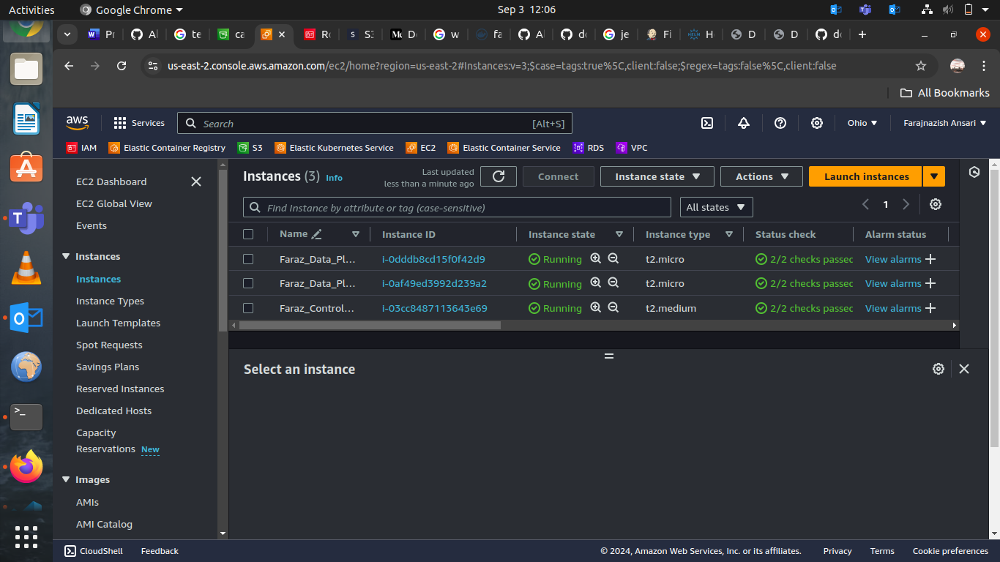

# Final Assessment Task:

### In this task, I have succesfully deployed a modular e-commerce application using AWS services and DevOps tools.

### The tools I used for this project are:

```
1. AWS
2. Terraform
3. Docker
4. Jenkins
5. GitHub
6. Ansible
7. K8S
8. Helm Chart
```

### So, first of all, I created terraform files to create below resources on AWS:
```
1. VPC
2. Security Groups
3. IAM Role
4. EC2 Instance (X3)
5. S3 Bucket
```

### When, the resources were successfully created on AWS, I created an e-commerce application using CSS/HTML. I dockerized the code and pushed the image to Docker hub using Jenkins pipeline with groovy language which was fetching the code from the GitHub.

### Then, I deployed the K8S kubeadm cluster on 3 EC2 instances out of which one was control plane and other two were data planes. I used ansible for deploying the kubeadm cluster.

### After that, I used the helm chart to successfully deploy my application and make it available to the end-users.

### Below are my terraform files and file structure for creating the resorces on AWS:

```
.
├── main.tf
├── variables.tf
└── vpc
|   ├── main.tf
|   ├── outputs.tf
|   └── variables.tf
├── sg
│   ├── main.tf
│   ├── outputs.tf
│   └── variables.tf
├── iam
│   ├── main.tf
│   ├── outputs.tf
│   └── variables.tf
├── ec2
│   ├── main.tf
│   └── variables.tf
├── s3
    ├── main.tf
    └── variables.tf
```
### main.tf:
```
provider "aws" {
  region  = "us-east-2"
  version = "~> 5.0"
}


module "vpc" {
  source = "./vpc"
}

module "sg" {
  source            = "./sg"
  name                = "Faraz_sg"
  vpc_id              = module.vpc.vpc_id
  container_port = var.container_port
  environment = var.environment
}

module "iam" {
  source                = "./iam"
}

module "s3_bucket" {
  source          = "./s3"
  }

module "ec2" {
  source              = "./ec2"
  key_name            = "Faraz_Key"
  subnet_id           = module.vpc.public_subnet_ids[0]
  security_group_ids  = [module.sg.security_group_id]

  ami                 = var.ami
  instance_type_1     = var.instance_type_1
  instance_type_2     = var.instance_type_2
  instance_name_1     = var.instance_name_1
  instance_name_2     = var.instance_name_2
  instance_name_3     = var.instance_name_3

  iam_instance_profile = module.iam.iam_instance_profile_name

}
```
### variables.tf:
```
variable "bucket_name" {
  description = "The name of the S3 bucket"
  type        = string
  default     = "kauserbucket"
}

variable "bucket_acl" {
  description = "The ACL for the S3 bucket"
  type        = string
  default     = "private"
}

variable "versioning_enabled" {
  description = "Enable versioning for the S3 bucket"
  type        = bool
  default     = true
}

variable "sse_algorithm" {
  description = "The server-side encryption algorithm to use"
  type        = string
  default     = "AES256"
}

variable "instance_type" {
  description = "Type of the EC2 instance (e.g., t2.micro)"
  type        = string
  default     = "t2.micro"
}

variable "instance_name" {
  description = "Type of the EC2 instance (e.g., t2.micro)"
  type        = string
  default     = "Faraz_instance"
}

variable "container_port" {
  description = "The port on which the container is running"
  type        = number
  default     = 80
}

variable "environment" {
  description = "The port on which the container is running"
  type        = string
  default     = "Dev"
}

variable "ami" {
  description = "The port on which the container is running"
  type        = string
  default     = "ami-085f9c64a9b75eed5"
}

variable "instance_type_1" {
  description = "The port on which the container is running"
  type        = string
  default     = "t2.medium"
}

variable "instance_type_2" {
  description = "The port on which the container is running"
  type        = string
  default     = "t2.micro"
}

variable "instance_name_1" {
  description = "The port on which the container is running"
  type        = string
  default     = "Faraz_Control_Plane"
}

variable "instance_name_2" {
  description = "The port on which the container is running"
  type        = string
  default     = "Faraz_Data_Plane_1"
}

variable "instance_name_3" {
  description = "The port on which the container is running"
  type        = string
  default     = "Faraz_Data_Plane_2"
}
```

### vpc/main.tf:
```
resource "aws_vpc" "main" {
  cidr_block = var.cidr
}

resource "aws_internet_gateway" "main" {
  vpc_id = aws_vpc.main.id
}

resource "aws_subnet" "private" {
  vpc_id            = aws_vpc.main.id
  cidr_block        = element(var.private_subnets, count.index)
  availability_zone = element(var.availability_zones, count.index)
  count             = length(var.private_subnets)
}

resource "aws_subnet" "public" {
  vpc_id                  = aws_vpc.main.id
  cidr_block              = element(var.public_subnets, count.index)
  availability_zone       = element(var.availability_zones, count.index)
  count                   = length(var.public_subnets)
  map_public_ip_on_launch = true
}

resource "aws_route_table" "public" {
  vpc_id = aws_vpc.main.id
}

resource "aws_route" "public" {
  route_table_id         = aws_route_table.public.id
  destination_cidr_block = "0.0.0.0/0"
  gateway_id             = aws_internet_gateway.main.id
}

resource "aws_route_table_association" "public" {
  count          = length(var.public_subnets)
  subnet_id      = element(aws_subnet.public.*.id, count.index)
  route_table_id = aws_route_table.public.id
}

resource "aws_route_table" "private" {
  count  = length(var.private_subnets)
  vpc_id = aws_vpc.main.id
}

resource "aws_route_table_association" "private" {
  count          = length(var.private_subnets)
  subnet_id      = element(aws_subnet.private.*.id, count.index)
  route_table_id = element(aws_route_table.private.*.id, count.index)
}
```
### vpc/variables.tf:
```
variable "cidr" {
  description = "The CIDR block for the VPC"
  type        = string
  default     = "10.0.0.0/16"
}

variable "public_subnets" {
  description = "The list of public subnets CIDR blocks"
  type        = list(string)
  default     = ["10.0.3.0/24"]
}

variable "private_subnets" {
  description = "The list of private subnets CIDR blocks"
  type        = list(string)
  default     = ["10.0.1.0/24", "10.0.2.0/24"] 
}

variable "availability_zones" {
  description = "The list of availability zones"
  type        = list(string)
  default     = ["us-east-2a", "us-east-2b"]
}

```
### vpc/outputs.tf:
```
output "vpc_id" {
  value = aws_vpc.main.id
}

output "public_subnet_ids" {
  description = "IDs of the public subnets"
  value       = aws_subnet.public[*].id
}

output "public_subnets" {
  value = aws_subnet.public[*].id
}

output "private_subnets" {
  value = aws_subnet.private[*].id
}
```

### sg/main.tf:
```
resource "aws_security_group" "vpc" {
  name   = "${var.name}"
  vpc_id = var.vpc_id

  ingress {
    protocol         = "tcp"
    from_port        = 80
    to_port          = 80
    cidr_blocks      = ["0.0.0.0/0"]
    ipv6_cidr_blocks = ["::/0"]
  }

  ingress {
    protocol         = "tcp"
    from_port        = 443
    to_port          = 443
    cidr_blocks      = ["0.0.0.0/0"]
    ipv6_cidr_blocks = ["::/0"]
  }

  ingress {
    protocol         = "tcp"
    from_port        = 22
    to_port          = 22
    cidr_blocks      = ["0.0.0.0/0"]
    ipv6_cidr_blocks = ["::/0"]
  }

  ingress {
    protocol         = "icmp"
    from_port        = -1
    to_port          = -1
    cidr_blocks      = ["0.0.0.0/0"]
    ipv6_cidr_blocks = ["::/0"]
  }

  ingress {
    protocol         = "tcp"
    from_port        = 0
    to_port          = 65535
    cidr_blocks      = ["0.0.0.0/0"]
    ipv6_cidr_blocks = ["::/0"]
  }

  egress {
    protocol         = "-1"
    from_port        = 0
    to_port          = 0
    cidr_blocks      = ["0.0.0.0/0"]
    ipv6_cidr_blocks = ["::/0"]
  }
}

```

### sg/variables.tf:
```
variable "vpc_id" {
  description = "The ID of the VPC"
  type        = string
}

variable "container_port" {
  description = "The port on which the container is running"
  type        = number
}

variable "name" {
  description = "The name prefix for resources"
  type        = string
  default = "Faraz"
}

variable "environment" {
  description = "The environment name (e.g., dev, prod)"
  type        = string
}

```

### sg/outputs.tf:
```
output "security_group_id" {
  description = "ID of the security group"
  value       = aws_security_group.vpc.id
}
```

### iam/main.tf:

```
resource "aws_iam_role" "ec2_s3_role" {
  name = "ec2_s3_role"

  assume_role_policy = jsonencode({
    Version = "2012-10-17",
    Statement = [
      {
        Action    = "sts:AssumeRole",
        Effect    = "Allow",
        Principal = {
          Service = "ec2.amazonaws.com",
        },
      },
    ],
  })
}


resource "aws_iam_policy" "s3_access_policy" {
  name        = "s3_access_policy"
  description = "Policy to allow EC2 instances to access S3 bucket"
  
  policy = jsonencode({
    Version = "2012-10-17",
    Statement = [
      {
        Action   = ["s3:GetObject", "s3:PutObject", "s3:ListBucket"],
        Effect   = "Allow",
        Resource = [
          "arn:aws:s3:::kauserbucket",
          "arn:aws:s3:::kauserbucket/*",
        ],
      },
    ],
  })
}

resource "aws_iam_role_policy_attachment" "s3_policy_attachment" {
  policy_arn = aws_iam_policy.s3_access_policy.arn
  role      = aws_iam_role.ec2_s3_role.name
}

resource "aws_iam_instance_profile" "ec2_s3_profile" {
  name = "ec2_s3_instance_profile"
  role = aws_iam_role.ec2_s3_role.name
}

```

### iam/variables.tf:
```
variable "role_name" {
  type        = string
  default = "Faraz_Role"
}

variable "tags" {
  type        = string
  default = "FarazRole"
}
```

### iam/outputs.tf:
```
output "iam_instance_profile_name" {
  value = aws_iam_instance_profile.ec2_s3_profile.name
}

output "iam_role_name" {
  value = aws_iam_role.ec2_s3_role.name
}
```

### ec2/main.tf:
```
resource "aws_instance" "master" {
  ami                    = var.ami
  instance_type          = var.instance_type_1
  key_name               = var.key_name
  subnet_id              = var.subnet_id
  vpc_security_group_ids = var.security_group_ids
  iam_instance_profile   = var.iam_instance_profile

  tags = merge({
    Name = var.instance_name_1
  })
}

resource "aws_instance" "worker_1" {
  ami                    = var.ami
  instance_type          = var.instance_type_2
  key_name               = var.key_name
  subnet_id              = var.subnet_id
  vpc_security_group_ids = var.security_group_ids
  iam_instance_profile   = var.iam_instance_profile

  tags = merge({
    Name = var.instance_name_2
  })
}

resource "aws_instance" "worker_2" {
  ami                    = var.ami
  instance_type          = var.instance_type_2
  key_name               = var.key_name
  subnet_id              = var.subnet_id
  vpc_security_group_ids = var.security_group_ids
  iam_instance_profile   = var.iam_instance_profile

  tags = merge({
    Name = var.instance_name_3
  })
}

```

### ec2/variables.tf:
```
variable "ami" {
  description = "AMI to be used for the instance"
  type        = string
  default     = "ami-085f9c64a9b75eed5"
}

variable "instance_type_1" {
  description = "Type of the instance (e.g., t2.micro)"
  type        = string
  default     = "t2.medium"
}

variable "instance_type_2" {
  description = "List of security group IDs to assign to the instance"
  type        = string
  default     = "t2.micro"
}

variable "key_name" {
  description = "Name of the SSH key to use"
  type        = string
  default = "Faraz_Key"
}

variable "subnet_id" {
  description = "Subnet ID where the instance will be placed"
  type        = string
}

variable "instance_name_1" {
  description = "Subnet ID where the instance will be placed"
  type        = string
  default     = "Faraz_Control_Plan"
}

variable "instance_name_2" {
  description = "Subnet ID where the instance will be placed"
  type        = string
  default     = "Faraz_Data_Plan_1"
}

variable "instance_name_3" {
  description = "Subnet ID where the instance will be placed"
  type        = string
  default     = "Faraz_Data_Plan_2"
}

variable "security_group_ids" {
  description = "List of security group IDs to assign to the instance"
  type        = list(string)
}

variable "iam_instance_profile" {
  description = "IAM instance profile for EC2 instances"
  type        = string
}
```

### s3/main.tf:
```
resource "aws_s3_bucket" "bucket" {
  bucket = var.bucket_name
  acl    = var.bucket_acl

  tags = merge({
    Name = var.bucket_name
  }, var.additional_tags)
}

resource "aws_s3_bucket_versioning" "versioning" {
  bucket = aws_s3_bucket.bucket.id 

  versioning_configuration {
    status = var.versioning_enabled ? "Enabled" : "Suspended"
  }
}

resource "aws_s3_bucket_server_side_encryption_configuration" "sse" {
  bucket = aws_s3_bucket.bucket.id

  rule {
    apply_server_side_encryption_by_default {
      sse_algorithm = var.sse_algorithm
    }
  }
}

resource "aws_s3_bucket_public_access_block" "public_access_block" { 
  bucket = aws_s3_bucket.bucket.id  

  block_public_acls   = false
  block_public_policy = false
  ignore_public_acls  = false
  restrict_public_buckets = false
}

```
### s3/variables.tf:
```
variable "bucket_name" {
  description = "The name of the S3 bucket"
  type        = string
  default = "kauserbucket"
}

variable "bucket_acl" {
  description = "The ACL for the S3 bucket"
  type        = string
  default     = "private"
}

variable "versioning_enabled" {
  description = "Enable versioning for the S3 bucket"
  type        = bool
  default     = true
}

variable "sse_algorithm" {
  description = "The server-side encryption algorithm to use"
  type        = string
  default     = "AES256"
}

variable "additional_tags" {
  description = "Additional tags to apply to the S3 bucket"
  type        = map(string)
  default     = {}
}
```

### These files will create all the resources successfully on the AWS with proper networking configuration as can be seen in the below images:





### Then, I created an index.html file using CSS/HTML which is below:
```
<!DOCTYPE html>
<html lang="en">
<head>
    <meta charset="UTF-8">
    <meta name="viewport" content="width=device-width, initial-scale=1.0">
    <title>Display Image</title>
    <style>
        body {
            text-align: center;
        }
        #access-section {
            text-align: left;
            margin-left: 20px;
        }
        #image {
            display: none;
            margin-top: 20px;
            width: 500px;
            height: auto;
        }
    </style>
</head>
<body>
    <h1>Welcome to e-commerce website.</h1>
    <p>You can buy many things here.</p>

    <div id="access-section">
        <p>To access S3 bucket image:</p>
        <button id="showImageBtn">Show Image</button>
    </div>

    

    <script>
        document.getElementById('showImageBtn').addEventListener('click', function() {
            var img = document.getElementById('image');
            img.style.display = img.style.display === 'none' ? 'block' : 'none';
        });
    </script>
</body>
</html>
```
### This is my nginx.conf file:
```
events {
    worker_connections 1024;
}

http {
    server {
        listen 80;
        server_name localhost;

        location / {
            root /usr/share/nginx/html;
            index index.html;
        }
    }
}

```

### I dockerized the above code using below Dockerfile:
```
FROM nginx:alpine
COPY nginx.conf /etc/nginx/nginx.conf
COPY index.html /usr/share/nginx/html/index.html
EXPOSE 80
CMD ["nginx", "-g", "daemon off;"]
```

### This is my Jenkinsfile:
```
node {
    def dockerRegistry = 'https://registry.hub.docker.com'
    def dockerCredentialsId = 'dockerhub-credentials-id'
    def imageName = 'fansari9993/test9'
    def imageTag = 'tagname'
    def image

    try {
        stage('Source Code Checkout') {
            checkout([
                $class: 'GitSCM',
                branches: [[name: '*/main']],
                doGenerateSubmoduleConfigurations: false,
                extensions: [],
                userRemoteConfigs: [[url: 'https://github.com/faraz9993/dock_jen.git']]
            ])
        }

        stage('Build Docker Image') {
            image = docker.build("${imageName}:${imageTag}")
        }

        stage('Push Docker Image') {
            docker.withRegistry("${dockerRegistry}", "${dockerCredentialsId}") {
                image.push()
            }
        }
    } catch (Exception e) {
        currentBuild.result = 'FAILURE'
        echo "Pipeline failed: ${e.message}"
    } finally {
        echo "Cleaning up workspace..."
        cleanWs()
    }
}
```
### I pushed all these files to the GitHub Repo.


### I configured the Jenkins pipeline to fetch the files form this git hub repo which will build the docker image and push it to my docker repository succesffully as can be seen in the below images.


### The next step is to deploy kubeadm cluster with 3 EC2 instances using Ansible.

### For that below is my inventory:
```
[controlplane]
web ansible_host=18.119.124.108 ansible_user=ubuntu ansible_ssh_private_key_file=/home/einfochips/Downloads/Faraz_Key_1.pem

[dataplane]
web ansible_host=52.14.237.7 ansible_user=ubuntu ansible_ssh_private_key_file=/home/einfochips/Downloads/Faraz_Key_1.pem
web ansible_host=3.21.247.233 ansible_user=ubuntu ansible_ssh_private_key_file=/home/einfochips/Downloads/Faraz_Key_1.pem
```

### Below is my main.yaml:
```
---
- name: Deploy Kubernetes scripts to control plane and data plane
  hosts: all
  become: yes

  tasks:
    - name: copying master.sh to control plane
      ansible.builtin.copy:
        src: master.sh
        dest: /home/{{ ansible_user }}/master.sh
        mode: '0755'
      when: "'controlplane' in group_names"

    - name: copying worker.sh to data plane
      ansible.builtin.copy:
        src: worker.sh
        dest: /home/{{ ansible_user }}/worker.sh
        mode: '0755'
      when: "'dataplane' in group_names"

    - name: run worker.sh on data plane
      ansible.builtin.shell: /home/{{ ansible_user }}/worker.sh
      when: "'dataplane' in group_names"

    - name: run master.sh on control plane
      ansible.builtin.shell: /home/{{ ansible_user }}/master.sh
      when: "'controlplane' in group_names"
```

### Below is my master.sh script:
```
#!/bin/bash
sudo apt-get update
sudo apt-get install -y apt-transport-https ca-certificates curl gpg
curl -fsSL https://pkgs.k8s.io/core:/stable:/v1.31/deb/Release.key | sudo gpg --dearmor -o /etc/apt/keyrings/kubernetes-apt-keyring.gpg
echo 'deb [signed-by=/etc/apt/keyrings/kubernetes-apt-keyring.gpg] https://pkgs.k8s.io/core:/stable:/v1.31/deb/ /' | sudo tee /etc/apt/sources.list.d/kubernetes.list
sudo apt-get update
sudo apt-get install -y kubelet kubeadm kubectl
sudo systemctl enable --now kubelet
kubeadm init
sudo apt-mark hold kubelet kubeadm kubectl
sudo apt-get install -y containerd
sudo systemctl enable containerd --now
sudo sysctl -w net.ipv4.ip_forward=1
echo 'net.ipv4.ip_forward=1' | sudo tee -a /etc/sysctl.conf
sudo sysctl -p
sudo kubeadm init --pod-network-cidr=192.168.0.0/16

mkdir -p $HOME/.kube
sudo cp -i /etc/kubernetes/admin.conf $HOME/.kube/config
sudo chown $(id -u):$(id -g) $HOME/.kube/config
kubectl apply -f https://docs.projectcalico.org/manifests/calico.yaml
kubectl apply -f https://raw.githubusercontent.com/coreos/flannel/master/Documentation/kube-flannel.yml
kubectl get nodes 
```
### Below is my worker.sh script:
```
#!/bin/bash
sudo apt-get update
sudo apt-get install -y apt-transport-https ca-certificates curl gpg
curl -fsSL https://pkgs.k8s.io/core:/stable:/v1.31/deb/Release.key | sudo gpg --dearmor -o /etc/apt/keyrings/kubernetes-apt-keyring.gpg
echo 'deb [signed-by=/etc/apt/keyrings/kubernetes-apt-keyring.gpg] https://pkgs.k8s.io/core:/stable:/v1.31/deb/ /' | sudo tee /etc/apt/sources.list.d/kubernetes.list    
sudo apt-get update
sudo apt-get install -y kubelet kubeadm kubectl
sudo systemctl enable --now kubelet
sudo apt-get update
sudo apt-get install -y containerd
sudo systemctl enable containerd --now
sudo sysctl -w net.ipv4.ip_forward=1
echo 'net.ipv4.ip_forward=1' | sudo tee -a /etc/sysctl.conf
sudo sysctl -p
```
### When I ran the below command, it has succesfully, created a cluster:

```
ansible-playbook main.yaml -i inventory
```

### However, I had to join both the data planes with control plane using kubeadm join token by entering the command manually.

### Below is my image which shows the succesful creation of the kubeadm cluster with one control plane and a couple of data planes.


### Next, I have to deploy the application on k8s cluster using helm chart with the Dockerimage, I pushed earlier in the docker hub.

### For that, I installed helm chart manually on the control plane using below given three commands:

```
curl -fsSL -o get_helm.sh https://raw.githubusercontent.com/helm/helm/main/scripts/get-helm-3
chmod 700 get_helm.sh
./get_helm.sh
```

### Once, the helm chart was successfully installed, I created a Helm chart using the below command:
```
helm create my-nginx-chart
```
### This command, created the defaut helm chart directory structure. 

### Next, I updated the value.yaml file with below file:
```
# Default values for my-nginx-chart.
# This is a YAML-formatted file.
# Declare variables to be passed into your templates.

replicaCount: 1

image:
  repository: fansari9993/test9
  pullPolicy: IfNotPresent
  # Overrides the image tag whose default is the chart appVersion.
  tag: tagname

imagePullSecrets: []
nameOverride: ""
fullnameOverride: ""

serviceAccount:
  # Specifies whether a service account should be created
  create: true
  # Automatically mount a ServiceAccount's API credentials?
  automount: true
  # Annotations to add to the service account
  annotations: {}
  # The name of the service account to use.
  # If not set and create is true, a name is generated using the fullname template
  name: ""

podAnnotations: {}
podLabels: {}

podSecurityContext: {}
  # fsGroup: 2000

securityContext: {}
  # capabilities:
  #   drop:
  #   - ALL
  # readOnlyRootFilesystem: true
  # runAsNonRoot: true
  # runAsUser: 1000

service:
  type: NodePort
  port: 80
  nodePort: 30000

ingress:
  enabled: false
  className: ""
  annotations: {}
    # kubernetes.io/ingress.class: nginx
    # kubernetes.io/tls-acme: "true"
  hosts:
    - host: chart-example.local
      paths:
        - path: /
          pathType: ImplementationSpecific
  tls: []
  #  - secretName: chart-example-tls
  #    hosts:
  #      - chart-example.local

resources: {}
  # We usually recommend not to specify default resources and to leave this as a conscious
  # choice for the user. This also increases chances charts run on environments with little
  # resources, such as Minikube. If you do want to specify resources, uncomment the following
  # lines, adjust them as necessary, and remove the curly braces after 'resources:'.
  # limits:
  #   cpu: 100m
  #   memory: 128Mi
  # requests:
  #   cpu: 100m
  #   memory: 128Mi

livenessProbe:
  httpGet:
    path: /
    port: http
readinessProbe:
  httpGet:
    path: /
    port: http

autoscaling:
  enabled: false
  minReplicas: 1
  maxReplicas: 100
  targetCPUUtilizationPercentage: 80
  # targetMemoryUtilizationPercentage: 80

# Additional volumes on the output Deployment definition.
volumes: []
# - name: foo
#   secret:
#     secretName: mysecret
#     optional: false

# Additional volumeMounts on the output Deployment definition.
volumeMounts: []
# - name: foo
#   mountPath: "/etc/foo"
#   readOnly: true

nodeSelector: {}

tolerations: []

affinity: {}
```
### After, this configuration, I deployed the helm chart using the below command:
```
helm install my-nginx-release ./my-nginx-chart
```

### This way, I successfully, deployed the application on the k8s cluster which created the service, deployment and the pods in the running state, as can be seen in the below image:


### I ran the below command, to know that on which data plane, my application has been deployed.
```
kubectl get pods -o wide
```


### I matched the Private IP address with the Public IP address on the console and hit it on the browser with the port number on which my application is forwarded as can be seen in the image above. 


### I got my application successfully, as can be seen in the below images:


### The car image that is appearing on the screen is the image that is fetched from my s3 bucket.


